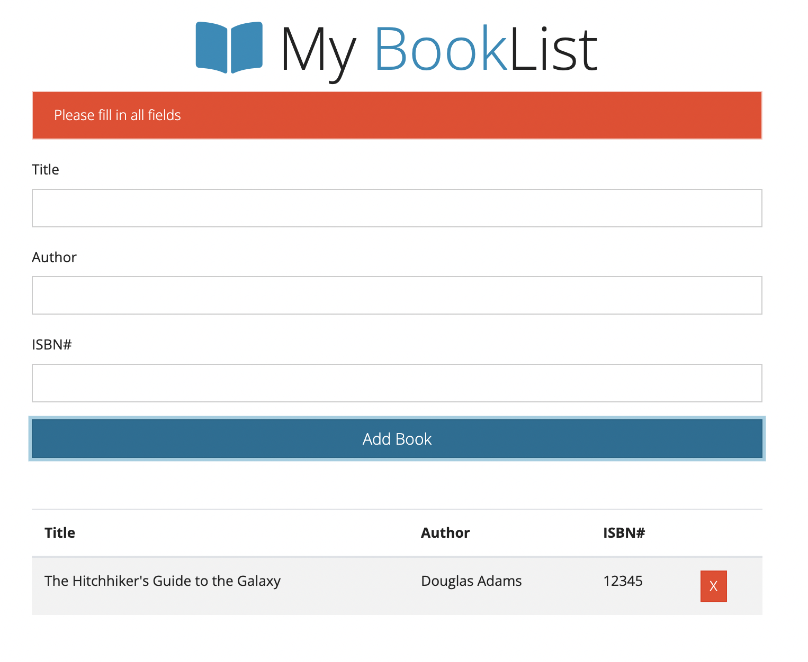
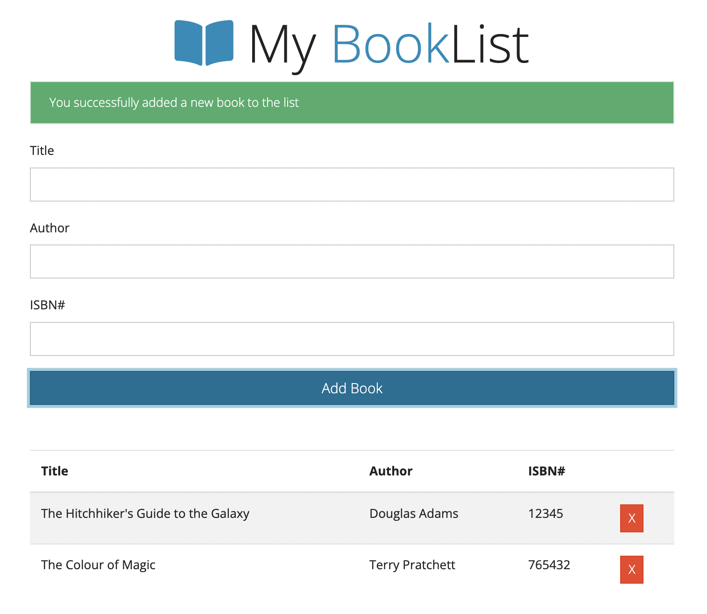

#### JS OOP Projects

1.  Book List Project with vanilla JS / OOP using ES6 classes

- [tutorial](https://www.youtube.com/watch?v=JaMCxVWtW58)
- Add and delete books; saving book list on the localStorage
- using free themes for Bootstrap from https://bootswatch.com;

    

    

